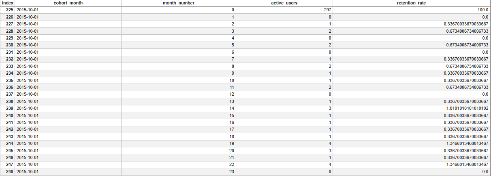
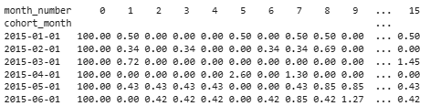
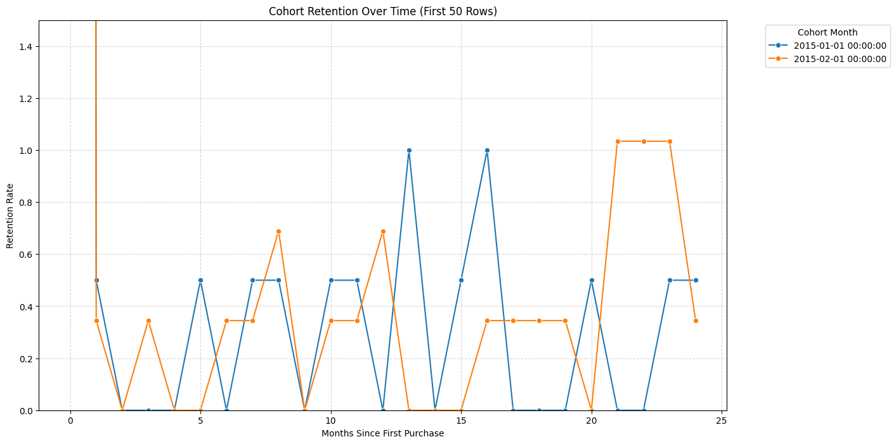

# Cohort Retention Analysis for Online Store

## 📌 Project Overview

This project analyzes **user retention over time** using cohort analysis on an online store dataset.
The goal is to understand user behavior, identify drop-off patterns, and provide actionable insights.

---

## 🔹 What is Cohort Analysis?

A **cohort** is a group of users sharing a common characteristic during a specific time period, typically their **first purchase or signup date**.
Cohort Retention Analysis tracks these users over time to measure engagement and retention.

---

## 📂 Dataset

The dataset includes the following columns:

| Column Name       | Description                         |
| ----------------- | ----------------------------------- |
| `customer_id`     | Unique identifier for each customer |
| `order_date`      | Date of purchase                    |
| `order_id`        | Unique order identifier             |
| `revenue` *(opt)* | Purchase amount                     |

> Table used: `sales`

---

## 🛠 Steps of Analysis

### 1️⃣ Find First Purchase Date

This step identifies the first purchase for each customer, which determines their **cohort month**.

```sql
WITH first_purchase AS (
    SELECT 
        customerkey,
        DATE_TRUNC('month', MIN(orderdate))::date AS cohort_month
    FROM sales
    GROUP BY customerkey
)
```

### 2️⃣ Assign Orders to Cohorts

Each order is associated with the cohort of its customer to track retention over time.

```sql
orders_with_cohort AS (
    SELECT 
        s.customerkey,
        DATE_TRUNC('month', s.orderdate)::date AS order_month,
        fp.cohort_month
    FROM sales s
    JOIN first_purchase fp
    USING(customerkey)
)
```

### 3️⃣ Calculate Cohort Sizes

Count the number of unique customers in each cohort.

```sql
cohort_sizes AS (
    SELECT 
        cohort_month,
        COUNT(DISTINCT customerkey) AS cohort_size
    FROM first_purchase
    GROUP BY cohort_month
)
```

### 4️⃣ Compute Monthly Retention

Calculate active users and retention rate per month for each cohort.

```sql
SELECT
    o.cohort_month,
    (EXTRACT(YEAR FROM o.order_month) - EXTRACT(YEAR FROM o.cohort_month)) * 12 +
    (EXTRACT(MONTH FROM o.order_month) - EXTRACT(MONTH FROM o.cohort_month)) AS month_number,
    COUNT(DISTINCT o.customerkey) AS active_users,
    COUNT(DISTINCT o.customerkey)::float / c.cohort_size AS retention_rate
FROM orders_with_cohort o
JOIN cohort_sizes c
ON o.cohort_month = c.cohort_month
GROUP BY o.cohort_month, month_number, c.cohort_size
ORDER BY o.cohort_month, month_number;
```

> **Explanation:**
>
> * `month_number`: Difference in months from the cohort start
> * `active_users`: Number of customers active in that month
> * `retention_rate`: Fraction of cohort still active

---
## Cohort Retention (Sample Data)



## 📊 Retention Matrix




---

## Heatmap Visualization




```python
import pandas as pd
import matplotlib.pyplot as plt
import seaborn as sns


df = pd.read_csv("cohort_retention_analysis3.csv").head(50)
df['cohort_month'] = pd.to_datetime(df['cohort_month'])

plt.figure(figsize=(14, 8))


palette = sns.color_palette("tab10", n_colors=df['cohort_month'].nunique())


sns.lineplot(
    data=df,
    x='month_number',
    y='retention_rate',
    hue='cohort_month',
    marker='o',
    palette=palette
)

plt.title("Cohort Retention Over Time (First 50 Rows)")
plt.xlabel("Months Since First Purchase")
plt.ylabel("Retention Rate")
plt.ylim(0, 0.3)  
plt.legend(title='Cohort Month', bbox_to_anchor=(1.05, 1), loc='upper left')
plt.grid(True, linestyle='--', alpha=0.5)
plt.show()
```

---

## 📈 Key Insights

* Identify months or periods with high user drop-off
* Compare behavior of new vs returning users
* Suggest improvements to increase retention

---

## 🔗 References

* [Cohort Analysis Concepts](https://www.optimizely.com/optimization-glossary/cohort-analysis/)
* [SQL Cohort Analysis Tutorial](https://mode.com/sql-tutorial/sql-cohort-analysis/)
* [Python Heatmap Example](https://seaborn.pydata.org/examples/heatmap_annotation.html)

---


